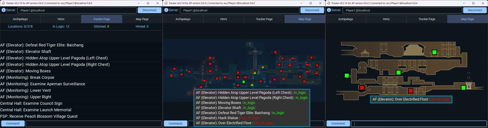

# Nine Sols Archipelago Randomizer

A Nine Sols mod for [the Archipelago multi-game randomizer system](https://archipelago.gg/).

## Status (as of October 2025)

Playable: Yes.

Stable: Yes. All known, reproducible bugs have been fixed.

Feature Completeness: Minimal. See Roadmap.

## Contact

For questions, feedback, or discussion related to the randomizer, please visit the "Nine Sols" thread in [the Archipelago Discord server](https://discord.gg/8Z65BR2), or the "Archipelago Randomizer" thread in [the Nine Sols Modding Discord server](https://discord.gg/sjA27B4e), or message me (`ixrec`) directly on Discord.

## What is an "Archipelago Randomizer", and why would I want one?

Let's say I'm playing Nine Sols, and my friend is playing Ocarina of Time. When I pick up the item dropped by Baichang, I find my friend's Hookshot, allowing them to reach several OoT chests they couldn't before. In one of those chests they find my Cloud Leap, allowing me to reach the Grotto of Scriptures. I retrieve the Shanhai 1000's map chip, and find my friend's Ocarina. This continues until we both find enough of our items to finish our games.

In essence, a multi-game randomizer system like Archipelago allows a group of friends to each bring whatever games they want (if they have an Archipelago mod) and smush them all together into one big cooperative multiplayer experience.

### What This Mod Changes

- The Archipelago items and locations are Yi's core movement abilities, almost every chest in the game (including the jin-only chests), every enemy drop, most of the objects you can examine for "database" entries, and several of the item-granting NPC interactions in FSP.
	- For now, none of the "post-PonR" content is randomized (except that the goal is defeating Eigong).
	- For now, none of the "post-all poisons" / Shennong questline / True Ending content is randomized.
	- For now, no shop items or skill tree upgrades are randomized.
- Starting a New Game will prompt you for Archipelago connection info, then put you immediately into the Four Seasons Pavilion (with power already on) instead of the usual intro sequence.
	- Teleport is immediately unlocked, along with one other root node for you to teleport too.
		- For now, this "first node" is always Apeman Facility (Monitoring).
		- This randomizer also depends on the TeleportFromAnywhere mod because you may need it to escape from a "dead end" with an important item.
	- The FSP's front door is "jammed" (i.e. the exit load zone is disabled), so you won't have immediate access to Central Hall.
	- Shuanshuan and Shennong are there immediately.
	- For now, Chiyou will move to FSP after checking the "Factory (GH): Raise the Bridge for Chiyou" location.
		- In vanilla it's triggered by escaping Prison and being rescued by Chiyou, which in randomizer would be too easy to skip over, and IMO would push too many things into a fixed/non-random order.
	- Like in vanilla, Kuafu will move to FSP after checking the "Kuafu's Vital Sanctum" location.
- Many scripted events are now either triggered by sol seal counts, unlocked immediately and forever, or skipped entirely.
	- The Jiequan 1 fight and Prison sequence become available after collecting (for now) 3 sol seals and Mystic Nymph: Scout Mode. Unlike the vanilla game, that's *any* 3 sol seals.
	- The Lady Ethereal Soulscape entrance appears after collecting (for now) any 4 sol seals.
	- For now, the New Kunlun Control Hub entrance opens after collecting 8 sol seals, instead of the Point of no Return cutscenes. This does make Tianhou Research Institute completely optional, but it should also ensure you have to do a lot more than find the SMB item to reach the final Eigong fight.
	- The Peach Blossom Village rescue can be done as soon as you find the Abandoned Mines Access Token and can reach the gate it unlocks. It's no longer tied to escaping Prison and being rescued by Chiyou.
	- All "Limitless Realm" segments are disabled/skipped for now.
	- Ji remains at Daybreak Tower to give you the Ancient Sheet Music even if he's supposed to be somewhere else.
	- Chiyou remains at the Factory (Great Hall) bridge until you check the "Factory (GH): Raise the Bridge for Chiyou" location, even if you do Boundless Repository first.

## Installation

### Prerequisites

- Make sure you have Nine Sols installed
	- The "speedrun branch" is not supported. Current/latest patch only.
- Install [r2modman](https://r2modman.net/#Download_R2modman_Latest_Version)
- Install the core Archipelago tools (at least version 0.5.0, but preferably the latest version) from [Archipelago's Github Releases page](https://github.com/ArchipelagoMW/Archipelago/releases). On that page, scroll down to the "Assets" section for the release you want, click on the appropriate installer for your system to start downloading it (for most Windows users, that will be the file called `Setup.Archipelago.X.Y.Z.exe`), then run it.
- Go to [the Releases page](https://github.com/Ixrec/NineSolsArchipelagoRandomizer/releases) of this repository and look at the latest release. There should be three files: A .zip, an .apworld and a .yaml. Download the .apworld and the .yaml.

### Archipelago tools setup

- Go to your Archipelago installation folder. Typically that will be `C:\ProgramData\Archipelago`.
- Put the `Nine.Sols.yaml` file in `Archipelago\Players`. You may leave the `.yaml` unchanged to play on default settings, or use your favorite text editor to read and change the settings in it.
- Double click on the `nine_sols.apworld` file. Archipelago should display a popup saying it installed the apworld. Optionally, you can double-check that there's now an `nine_sols.apworld` file in `Archipelago\custom_worlds\`.

#### I've never used Archipelago before. How do I generate a multiworld?

Let's create a randomized "multiworld" with only a single Nine Sols world in it.

- Make sure `Nine.Sols.yaml` is the only file in `Archipelago\Players` (subfolders here are fine).
- Double-click on `Archipelago\ArchipelagoGenerate.exe`. You should see a console window appear and then disappear after a few seconds.
- In `Archipelago\output\` there should now be a file with a name like `AP_95887452552422108902.zip`.
- Open https://archipelago.gg/uploads in your favorite web browser, and upload the output .zip you just generated. Click "Create New Room".
- The room page should give you a hostname and port number to connect to, e.g. "archipelago.gg:12345".

For a more complex multiworld, you'd put one `.yaml` file in the `\Players` folder for each world you want to generate. You can have multiple worlds of the same game (each with different options), as well as several different games, as long as each `.yaml` file has a unique player/slot name. It also doesn't matter who plays which game; it's common for one human player to play more than one game in a multiworld.

### Modding and Running Nine Sols

- In r2modman, create a profile and select the Nine Sols game. Then go to the "Mods" > "Online" section and search for "Archipelago Randomizer". Click on it to expand the listing, and click the Download button that appears (if you were wondering about the .zip file we didn't download earlier, that's what r2modman is installing).
- Now click the "Start modded" button in the top left corner. Note that you must launch Nine Sols through r2modman in order for the mods to be applied; launching from Steam won't work.
- Once you're at the main menu of Nine Sols itself, click "Start Game", click on an empty save slot, and you will be asked for connection info such as the hostname and port number. Unless you edited `Nine.Sols.yaml` (or used multiple `.yaml`s), your slot/player name will be "Solarian1". And by default, archipelago.gg rooms have no password.

#### What if I want to run a pre-release version for testing, or downgrade to an older version of this mod (so I can finish a longer async)?

Click here to show instructions

To use an older or pre-release version, you'll need to install a `Ixrec-ArchipelagoRandomizer-X.Y.Z.zip` manually. This repo's Releases page should have all the `.zip`s for different versions of the mod.

Once you have the `.zip` you want:
- In r2modman, go to "Other" > "Settings"
- Scroll down to "Import local mod" and click on it
- Click "Select file" and navigate to the mod `.zip`

## Client/Mod Settings

The client-side settings currently in the randomizer mod are:

- Boss Scaling
- Death Link
- Show Archipelago Messages In-Game

Press F1 in-game to bring up the settings menu for all of your Nine Sols mods, including the randomizer. This F1 menu comes from the [BepinExConfigurationManager](https://thunderstore.io/c/nine-sols/p/ninesolsmodding/BepinExConfigurationManager/) mod.

## Other Suggested Mods and Tools

Universal Tracker is fully supported by nine_sols.apworld, including yaml-less support, Map Pages, and auto-switching between Map Pages as you move between in-game areas.

For now, UT is also the only supported tracker, so it's very highly recommended. See the pinned messages [in its Discord thread](https://discord.com/channels/731205301247803413/1170094879142051912) for details.

[My CutsceneSkip mod](https://thunderstore.io/c/nine-sols/p/Ixrec/CutsceneSkip/) does exactly what it sounds like.

[N00byKing's NineSolsTracker mod](https://thunderstore.io/c/nine-sols/p/N00byKing/NineSolsTracker/) may help with finding items and chests in-game.

If you're good enough at the combat to want harder-than-vanilla fights, it's worth noting these mods add not only more difficulty but also more randomness:
- [MicheliniDev's EigongPrime](https://thunderstore.io/c/nine-sols/p/MicheliniDev/EigongPrime/) lifts a lot of the usual rules about which attacks Eigong can do when, making it feel more random which moves she chooses to perform. Especially if you enable the "IsRandom" setting.
- [Gogas1's BossChallengeMod](https://thunderstore.io/c/nine-sols/p/Gogas1/BossChallengeMod/) offers "random modifiers" on bosses, minibosses and regular enemies. This is compatible with EigongPrime. Personally, I like to set Max deaths to 2 (for bosses, minibosses and regulars), enable Modifiers, set Modifiers Start Death to 0, and disable the Damage Buildup modifier (since that one tends to turn all enemy attacks into one-hit kills).

## Roadmap

High-priority big features:
- randomize Wall Climb, Grapple and Ledge Grab starting abilities
- hard/glitch/trick logic
- random "spawn" / first root node

These are the priorities because they are heavily interconnected, and prerequisites for many other features.

Major features I'll probably do later:
- entrance randomization
- randomizing shop items
- randomizing the skill tree

Smaller features I haven't made up my mind on:
- trap items (Sniper Trap? Prison State Trap? Internal Damage Trap? etc)
- turning root node unlocks into items, like HK's shuffle stag stations option
- decide on additional goals, how to handle post-PonR content, and whether to do anything with the Chien/Chiyou/Shennong quests and True Ending
- in-game hints from the Shanhai 9000s
- randomize BGM

## Credits

- GameWyrm, Gregório, Hopop, Juanba, mynameis, XDrotkon and others in various Nine Sols and Archipelago-related Discord servers for feedback, discussion and encouragement
- dubi steinkek, yuki.kako, N00byKing and others from the "Nine Sols Modding" Discord server for help modding Nine Sols and for creating the other Nine Sols mods that this randomizer relies on or is often played with
- Flitter for talking me into trying out Archipelago randomizers in the first place
- All the Archipelago contributors who made that great multi-randomizer system
- Everyone at Red Candle Games who made this great game
